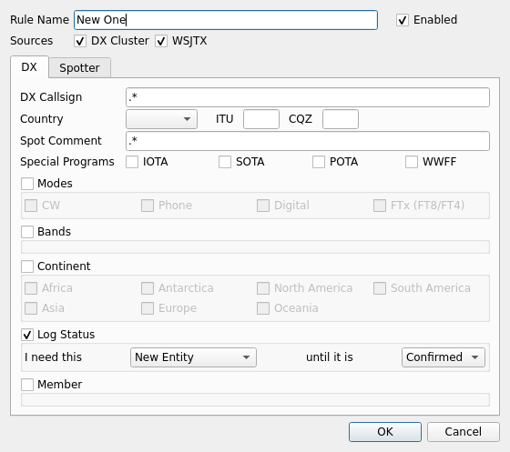
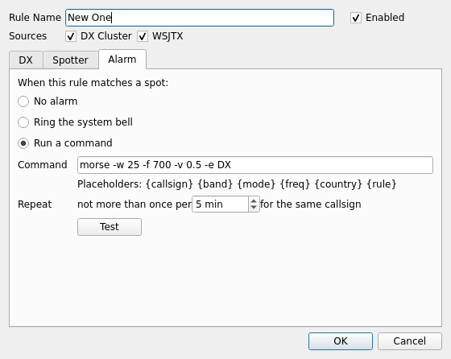
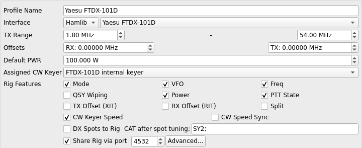

# QLog, the OH2GBA build

This is my daily [QLog](https://github.com/foldynl/QLog), with a handful of changes
that I wanted as a DXer and could not wait for. It is not an official QLog release; if
something here misbehaves, ask me, not the QLog maintainer. Most of the changes are also
offered upstream as pull requests, so with a bit of luck this page gets shorter over time.

The branch `master` of this fork is an untouched mirror of upstream. The branch you are
looking at, `oh2gba`, is upstream plus the changes below.

## Before you try it, read this

**This build changes the database.** It adds its own migrations (042 to 044) that the
official QLog does not have. A log opened with this build can no longer be opened by an
official release, and a future official release will not know how to migrate it.

So: **work on a copy of your log**, or keep a fresh ADIF export of it. If you later go back
to the official QLog, import that export into a new log. Do not point this build at the
only copy of your logbook.

## What is different

| Change | Why | Upstream |
|---|---|---|
| **Alert rule "Log Status"** reads as a sentence: *I need this [New Entity, New Band, New Mode, New Band & Mode] until it is [Worked, Confirmed]* | An alert for a country I worked but never got confirmed. I asked for it in words since 2024, this is the version that explains itself | [PR 1174](https://github.com/foldynl/QLog/pull/1174) |
| **Alert rule "Alarm"**: no alarm, the system bell, or a command of your own, per rule, with a repeat limit. *Mute Alarms* in the bell menu silences all of them | My alert sends "DX" in Morse through the shack speaker. Any sound tool or script works, QLog just starts it | [PR 1175](https://github.com/foldynl/QLog/pull/1175) |
| **Spot click lands on the spot** also on rigs that move the dial with the mode | The Yaesu FTDX series shifts the dial by the CW pitch between SSB and CW. QLog now sends the frequency once more after the mode | [PR 1191](https://github.com/foldynl/QLog/pull/1191) |
| **CAT command after a spot click**, a text field in the rig profile | `SY2;` makes the FTDX101 sub receiver follow the DX, on its own antenna. Two antennas, two receivers, one DX | [PR 1192](https://github.com/foldynl/QLog/pull/1192) |
| **No popup when the radio goes away** | Switching the rig off, pulling a cable or stopping rigctld showed a modal box that stole the focus. Now it is one line in the status bar. Same for rotator and CW keyer | local only |

### The alert rule, Log Status



The rule alerts as long as the sentence is true. Which QSLs count as a confirmation
(LoTW, eQSL, paper) is the same setting that colours the DX cluster window, so alerts
and colours always agree. Details in [doc/alert-log-status.md](doc/alert-log-status.md).

### The alert rule, Alarm



Placeholders `{callsign}`, `{band}`, `{mode}`, `{freq}`, `{country}` and `{rule}` are
filled in before the command starts. Examples for Linux, Windows and macOS are in
[doc/alert-alarm.md](doc/alert-alarm.md).

### The rig profile, CAT after spot tuning



Leave it empty and nothing happens. On a Yaesu FTDX101 put `SY2;` there.

## Building it

I build in a Docker container so that nothing has to be installed on the machine
(Debian 13, Qt 6.8, Hamlib 4.6.2):

```bash
git clone -b oh2gba https://github.com/oh2gba/QLog.git
cd QLog
mkdir build
docker build -f packaging/docker/Dockerfile -t qlog-build:trixie packaging
docker run --rm --user $(id -u):$(id -g) -e HOME=/tmp -v $PWD:/src -w /src/build \
    qlog-build:trixie bash -c 'qmake6 ../QLog.pro CONFIG+=release && make -j$(nproc)'
```

The binary ends up in `build/qlog`. I run it with its own data directory, so it never
touches the official installation:

```bash
build/qlog --namespace dev
```

## Credits

QLog is written by Ladislav Foldyna, OK1MLG, and friends. All of this sits on top of his work
and keeps the GPL licence that comes with it. The ideas are mine and everything
is tested on the air on a Yaesu FTDX-101D.

73, John OH2GBA
